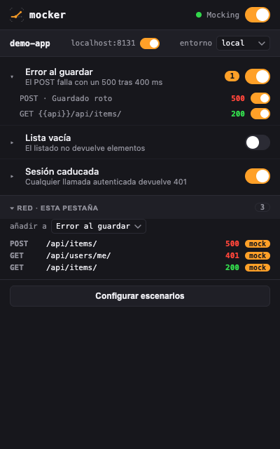
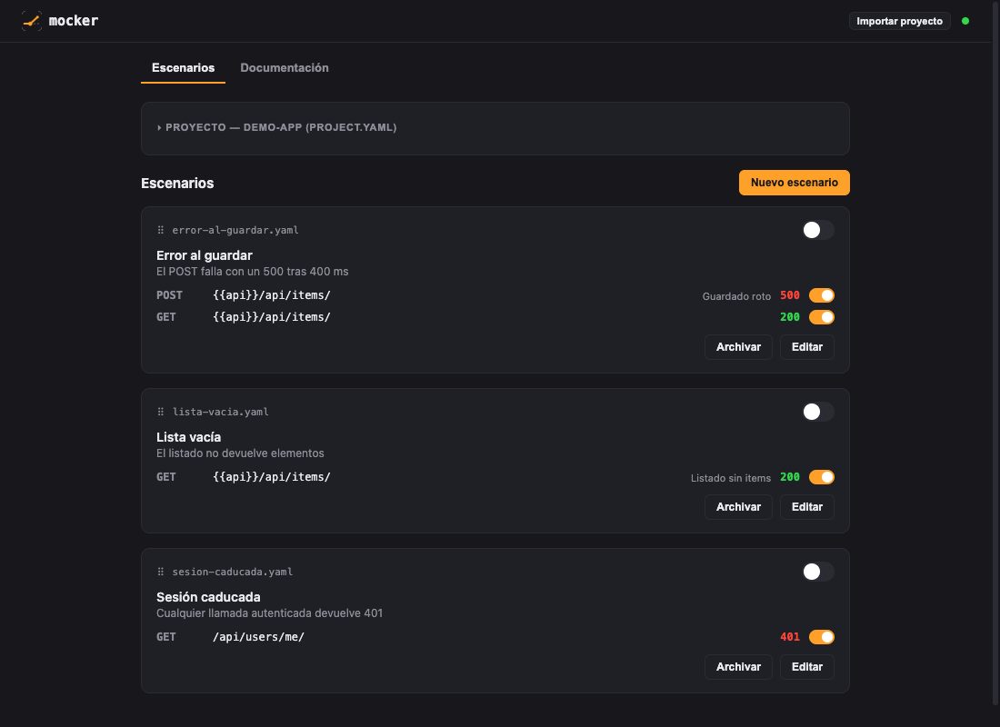
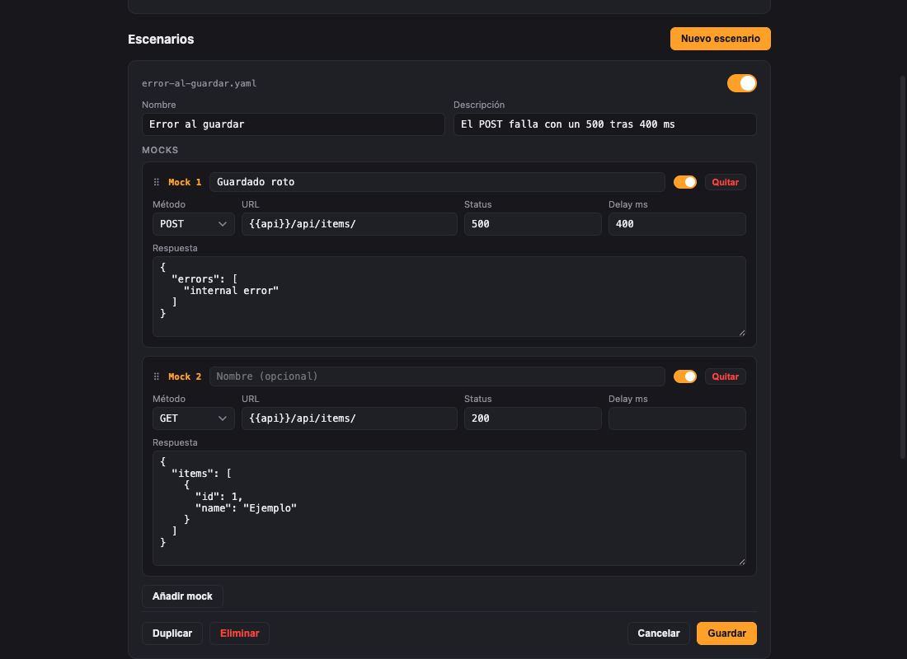

# Mocker

Scenario-based network mocking driven by files in your repo. Los escenarios de
mock viven como YAML en `.mocks/` dentro del repo de tu app (versionados con
las ramas, compartidos por git); la extensión de Chrome lee y escribe esa
carpeta directamente vía File System Access — sin procesos externos.

```
.mocks/ (en el repo de tu app)  ←fs→  extensión (Chrome MV3)
```

## Capturas

El popup: toggles por escenario y por mock, interruptor por origen, y el
tráfico de la pestaña con sus mocks marcados:



La página de configuración, con los escenarios en modo lectura:



Y el editor de un escenario (validación de variables, drag para reordenar):



## Estructura de un proyecto de mocks

```
tu-app/
└── .mocks/
    ├── project.yaml            # nombre + entornos
    └── scenarios/
        └── lista-vacia.yaml    # un fichero = un escenario con sus mocks
```

```yaml
# project.yaml
name: mi-app
environments:
  local:
    api: https://api.sta.example
```

La intercepción funciona en cualquier página con el toggle **Mocking**
encendido — no hay que declarar hosts.

```yaml
# scenarios/lista-vacia.yaml
name: Lista vacía
mocks:
  - method: GET
    url: '{{api}}/api/items/'
    status: 200
    response: []
```

Las variables `{{nombre}}` se resuelven con el entorno activo (se elige en la
tarjeta de proyecto de la página de configuración) y sirven para no repetir
hosts en cada mock: un mock, N entornos. Un valor vacío deja la URL como
pathname a secas. Con el matching fuzzy rara vez las necesitarás — su caso
fuerte es separar dos hosts que comparten pathname.

## Matching de URLs

No hace falta escribir el host. Una URL de mock matchea contra la URL completa,
`origin + pathname` o `pathname`, ignorando barras finales y la query string:

- `/api/items/` matchea `https://cualquier-host/api/items/?page=2`
- `api/items` (sin barra inicial) matchea como fragmento: cualquier pathname
  que lo contenga
- `*` es comodín: `/api/items/*/photos/` matchea cualquier id intermedio

## Uso

```bash
npm install
npm run build
```

1. Carga la extensión en Chrome: `chrome://extensions` → modo desarrollador →
   "Cargar descomprimida" → `extension/dist/`.
2. Abre la página de configuración y pulsa **Importar proyecto**: elige la
   carpeta `.mocks/` de tu repo (o el repo que la contiene). Eso carga el
   proyecto y todos sus escenarios.
3. Abre el popup y activa escenarios con el switch.

Chrome caduca el permiso sobre la carpeta en cada sesión nueva del navegador:
la extensión lo detecta y la página de configuración ofrece **Reconectar
carpeta** (un clic). Los cambios hechos por fuera (un `git pull`, un agente
editando los YAML) se recogen automáticamente cada 30 s y al abrir el popup o
la configuración.

## Para agentes

Un agente (Claude Code, etc.) trabaja sobre los mismos ficheros: edita los
YAML de `.mocks/` con sus tools normales y la extensión recoge los cambios
sola. Para cerrar el bucle sin navegador, mocker vuelca las últimas 50
requests capturadas a `.mocks/.runtime/requests.json`
(`{ updatedAt, requests: [...] }`); cada entrada trae la llamada hecha
(método, URL, `requestBody`), la respuesta recibida (`status`, `body`, ambos
recortados a 32KB) y, si la interceptó mocker, `mocked: true` con `scenario`,
`mockName` y `mockUrl` del mock que matcheó. Las entradas sin `mocked` son
tráfico real que pasó de largo — la cantera para crear mocks nuevos. Añade
`.mocks/.runtime/` al `.gitignore` del repo.

La activación es estado del navegador (no toca los ficheros) y tiene tres
niveles en el popup: un **toggle global** de interceptación en la cabecera,
un toggle por **escenario**, y — desplegando el escenario con ▸ — un toggle por
**mock** individual. Varios escenarios pueden estar activos a la vez y, si dos
mockean la misma URL, gana el último activado. El contador ámbar de cada
escenario indica cuántas requests ha matcheado en la sesión, y el botón
inferior abre la página de configuración. La sección plegable **Red · esta
pestaña** lista el tráfico capturado de la pestaña activa; el botón **+** de
cada request la añade como mock al escenario elegido en «añadir a».

## Los mocks se ven en la Console

Cada request matcheada se logea en la consola de la página con la URL original
intacta, al estilo de tweak:

```
mocker 16:34:56 GET https://localhost:3000/api/items/ 200 (lista-vacia)
```

El status va en verde (2xx/3xx) o rojo (4xx/5xx) y entre paréntesis aparece el
escenario que sirvió el mock. Las requests mockeadas no aparecen en la tab
Network (la respuesta es sintética, nunca sale del page-world) — la Console y
el contador verde del popup son las señales de que el mock está funcionando.

## Roadmap

- [x] Escenarios YAML en el repo + popup con toggles + intercepción fetch/XHR
- [x] Settings page con gestión completa (lectura/edición, crear, duplicar,
      archivar, reordenar, eliminar)
- [x] File System Access: sin CLI ni procesos externos
- [x] Captura de red con añadir-como-mock (popup y panel de DevTools)
- [x] Request log para agentes en `.mocks/.runtime/requests.json`
- [ ] Adopción: `.mocks/` en un repo real, empaquetado para el equipo
- [ ] Deuda: activación de mocks por índice (baila al reordenar), matching por
      query string, multi-proyecto

## Settings page

El botón del popup (o `chrome://extensions` → Mocker → Opciones) abre la
página de configuración en pestaña completa. Los escenarios se muestran en
**modo lectura** (nombre, descripción y sus mocks en filas compactas, con los
toggles de activación operativos); **Editar** abre el formulario completo
(nombre, descripción, mocks con nombre opcional,
método/URL/status/delay/respuesta), con Cancelar para volver sin guardar,
crear, duplicar, **archivar** (los escenarios archivados salen de las listas y
dejan de interceptar; viven plegados en la sección Archivados), **reordenar
arrastrando** (las tarjetas de escenario en lectura; los mocks por su asa ⠿ en
edición; el orden de escenarios se persiste en `project.yaml: order`) y
eliminar. La tarjeta de proyecto también
es plegable. Los toggles de activación (escenario y mock) aplican al instante,
sin pasar por Guardar; el toggle global de Mocking y el interruptor por origen
(dominio+puerto de la pestaña actual) viven en el popup. Renombrar = editar el
campo Nombre y guardar;
el fichero conserva su id para que la activación no se pierda. La tarjeta de
proyecto edita `project.yaml`: nombre y los entornos con sus variables
(sección plegable). Las URLs con `{{variables}}` se validan en vivo: borde
verde si la variable existe en todos los entornos, ámbar si falta en alguno y
rojo si no existe en ninguno, con el detalle en el tooltip.

## Panel de DevTools

Además del popup, mocker añade un panel **mocker** al inspector de Chrome
(DevTools) con la misma información, ligado a la pestaña inspeccionada:
escenarios con sus toggles y la sección de red con sus capturas y el botón
de añadir. Usa el que te resulte más cómodo — son la misma vista.

Guardar escribe el YAML en el repo (verás el diff en `git status`) — nada
tiene almacenamiento propio: todo queda en los ficheros. Si los ficheros
cambian mientras editas, un aviso te pide guardar o recargar en vez de pisarte
la edición.
